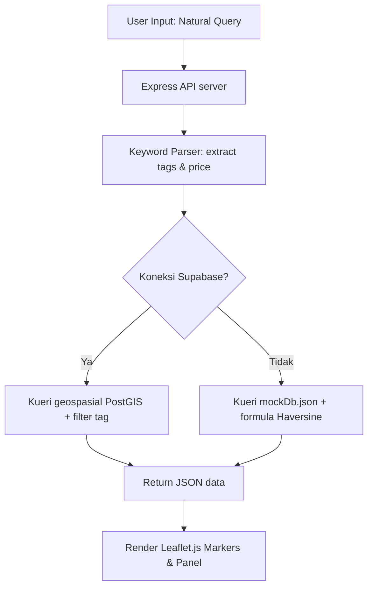

# **Mapsy: Platform Penyelamat Mahasiswa Berbasis Peta Geospasial dengan Fitur Smart Search by Situation dan Community Validation**

---

### **Authors**
1. **Nicholas** (School of Computer Science, Bina Nusantara University, Jakarta, Indonesia) - *nicholas043@binus.ac.id*
2. **Daffa Adira Pratama** (School of Computer Science, Bina Nusantara University, Jakarta, Indonesia) - *daffa.pratama004@binus.ac.id*
3. **Samuel Handyanto Ongko Saputra** (School of Computer Science, Bina Nusantara University, Jakarta, Indonesia) - *samuel.saputra005@binus.ac.id*
4. **Christian Devinchie** (School of Computer Science, Bina Nusantara University, Jakarta, Indonesia) - *christian.devinchie@binus.ac.id*

---

### **Abstract**
*Mahasiswa perguruan tinggi, terutama mahasiswa baru dan anak kost, seringkali menghadapi kendala saat mencari tempat yang kondusif untuk kebutuhan akademik maupun kehidupan sehari-hari di sekitar wilayah kampus. Aplikasi pemetaan komersial konvensional seperti Google Maps cenderung menyajikan rekomendasi yang terlalu umum, dipenuhi iklan komersial, dan tidak memiliki filter spesifik yang disesuaikan dengan kebutuhan khas mahasiswa. Makalah ini memperkenalkan **Mapsy**, sebuah platform peta geospasial hiper-lokal terdesentralisasi yang dirancang khusus untuk memecahkan masalah pencarian lokasi mahasiswa. Sistem ini mengintegrasikan dua inovasi utama: **Smart Search by Situation** yang menggunakan Dictionary-Driven Keyword Parser untuk mengekstraksi kebutuhan situasional pengguna tanpa memerlukan API LLM berbayar, serta **Community Validation** yang menerapkan sistem upvote/downvote tag secara kolaboratif guna mencegah kedaluwarsa data. Mapsy dikembangkan menggunakan arsitektur Decoupled Client-Server dengan frontend Vanilla JavaScript interaktif berbantuan Leaflet.js, serta backend Node.js/Express dengan database PostgreSQL (Supabase/PostGIS) dan fallback Mock Database lokal. Hasil pengujian menunjukkan bahwa platform ini mampu memberikan rekomendasi tempat secara instan berdasarkan preferensi harga (under Rp30k), ketersediaan daya listrik (colokan), tingkat ketenangan, koneksi Wi-Fi, hingga layanan printer terdekat.*

**Keywords—** *Agile, crowdsourcing, data geospasial, LBS, Mapsy, PostGIS, pencarian lokasi pintar, tempat ramah mahasiswa, aplikasi web.*

---

## **Chapter 1 - Introduction**

### **A. Latar Belakang & Masalah (Core Problem)**
Bagi mahasiswa perkotaan yang menuntut efisiensi tinggi, menemukan lokasi fisik yang tepat untuk belajar, mengerjakan tugas kelompok, mencetak dokumen, atau sekadar mencari makan dengan harga terjangkau merupakan tantangan sehari-hari yang cukup menyita waktu. Peta digital yang ada saat ini (seperti Google Maps atau Apple Maps) dirancang untuk kebutuhan komersial skala besar. Beberapa kelemahan utama peta konvensional dari sudut pandang mahasiswa meliputi:
1. **Tidak adanya filter situasional mahasiswa**: Tidak ada filter pencarian untuk "banyak colokan", "suasana tenang/sepi untuk nugas", atau "tempat print terdekat".
2. **Komersialisasi hasil pencarian**: Bisnis dengan anggaran iklan besar selalu menempati peringkat teratas, menenggelamkan tempat-tempat kecil bernilai tinggi bagi mahasiswa (*hidden gems*).
3. **Informasi harga yang tidak akurat**: Indikator harga seperti `$$` tidak mencerminkan anggaran riil mahasiswa (misal: mencari makan siang di bawah Rp30.000).
4. **Data tag yang mudah usang**: Kecepatan internet Wi-Fi kafe, jam operasional sesungguhnya, atau tingkat kebisingan sering berubah tanpa adanya pembaruan cepat dari komunitas pengguna.

Berdasarkan survei pendahuluan yang dilakukan terhadap 12 responden mahasiswa, sebanyak 50% menyatakan kesulitan menemukan toko atau fasilitas spesifik di sekitar kos mereka karena ketidaktahuan informasi dan terbatasnya ketersediaan produk/fasilitas.

### **B. Solusi yang Diusulkan (Proposed Solution)**
Untuk mengatasi keterbatasan tersebut, dikembangkan **Mapsy**, sebuah Single Page Application (SPA) berbasis peta interaktif yang berfokus pada visualisasi hiper-lokal di sekitar kampus (contoh uji coba: area BINUS University Bandung Paskal, ITB, dan UNPAD Dipatiukur). Solusi utama yang dihadirkan platform ini mencakup:
* **Smart Search by Situation**: Pengguna cukup memasukkan kalimat natural (seperti: *"butuh kafe yang tenang untuk nugas sampai malam"*). Mesin parser di backend akan secara otomatis menerjemahkannya menjadi tag terstruktur (`Quiet`, `Good Wi-Fi`, `24 hours`) tanpa biaya API AI yang mahal.
* **Community Validation (Sistem Anti-Data Usang)**: Setiap tag pada suatu lokasi dapat di-upvote atau di-downvote oleh mahasiswa yang telah masuk (login) menggunakan email kampus mereka. Tag yang mendapatkan skor negatif akan otomatis disembunyikan dari peta.
* **Algoritma Rating Berbobot (Temporal Decay)**: Sistem ulasan memberikan bobot ganda (2.0x) pada ulasan 30 hari terakhir dibanding ulasan lama untuk menjaga relevansi situasi terkini suatu tempat.
* **Zero-Cost Cache Strategy**: Server meng-cache data Google Places API secara lokal untuk meminimalisasi biaya operasional.

---

## **Chapter 2 - Literature Review**

Pengembangan platform Mapsy didasarkan pada beberapa teori rekayasa perangkat lunak dan teknologi web modern:
1. **Location-Based Services (LBS)**: Layanan yang mengintegrasikan lokasi geografis pengguna dengan fungsi dan utilitas layanan umum, seperti navigasi atau pencarian tempat terdekat [1].
2. **Digital Mapping Systems**: Sistem pemetaan digital yang memungkinkan pengguna berinteraksi langsung dengan visualisasi informasi geografis di layar gawai [2].
3. **Leaflet.js**: Library JavaScript open-source yang sangat ringan untuk membangun peta interaktif ramah mobile [3]. Library ini digunakan untuk merender penanda lokasi (markers), popup, dan interaksi geospasial pada frontend Mapsy.
4. **CARTO**: Platform spasial berbasis cloud yang memungkinkan visualisasi dan analisis data geografis secara tersentralisasi pada data warehouse [4].
5. **PostGIS & Supabase**: Ekstensi database PostgreSQL yang memungkinkan kueri spasial dan penyimpanan koordinat secara efisien menggunakan tipe data khusus (seperti Point, Polygon) serta indeks spasial GIST [5].
6. **Decoupled Client-Server Architecture**: Pemisahan yang jelas antara frontend (presentasi data) dan backend (pemrosesan data) menggunakan RESTful API.
7. **Geospasial & Formula Haversine**: Untuk menyortir lokasi terdekat pada mock database lokal, digunakan formula Haversine untuk menghitung jarak lingkaran besar antara dua titik koordinat:
   $$d = 2R \arcsin\left(\sqrt{\sin^2\left(\frac{\Delta \phi}{2}\right) + \cos(\phi_1)\cos(\phi_2)\sin^2\left(\frac{\Delta \lambda}{2}\right)}\right)$$
8. **Dictionary-Driven Keyword Parser**: Metode pengenalan pola teks dengan mencocokkan kata kunci masukan pengguna terhadap kamus sinonim yang telah ditentukan sebelumnya. Pendekatan ini sangat efisien secara komputasi dan tidak memerlukan koneksi internet aktif layaknya Large Language Models (LLM).

---

## **Chapter 3 - Methods**

### **A. SDLC & Development Process (Agile Scrum)**
Pengembangan Mapsy menggunakan metodologi **Agile Scrum** yang dibagi ke dalam 5 tahapan sprint utama:
* **Sprint 1: Requirements Gathering and Problem Analysis**: Identifikasi masalah mahasiswa, penetapan ruang lingkup proyek, dan perancangan daftar kebutuhan fungsional/non-fungsional.
* **Sprint 2: UI/UX Design and System Design**: Desain wireframe antarmuka (dark mode), arsitektur sistem decoupled, serta perancangan skema database.
* **Sprint 3: Map Search and Filter Implementation**: Integrasi Leaflet.js, pembuatan layer OpenStreetMap, dan implementasi kueri geospasial pencarian serta filter berbasis amenitas.
* **Sprint 4: Implementation of Crowdsourced Review and Validation**: Implementasi modul registrasi/login, fungsionalitas User Generated Content (UGC) untuk menambah lokasi baru, fitur rating berbasis waktu (*temporal decay*), dan tombol validasi tag (upvote/downvote).
* **Sprint 5: Testing, Evaluation, and Improvement**: Pengujian fungsional dan pengujian kegunaan (*usability testing*) kepada mahasiswa untuk menyempurnakan alur interaksi.

### **B. Desain Skema Database (ERD)**
Struktur penyimpanan data dirancang relasional untuk efisiensi upvote tag dan review mahasiswa:
1. **places**: Menyimpan nama tempat, deskripsi, koordinat (lat, lng), harga rata-rata (`avg_price_tier`), link foto (`image_url`), dan ID tempat Google.
2. **tags**: Menyimpan jenis-jenis tag situasional (`Quiet`, `Good Wi-Fi`, `Many charging ports`, `24 hours`, `Printer nearby`).
3. **place_tags**: Tabel jembatan relasi N-to-N antara tempat dan tag yang menyimpan `confidence_score` (skor validasi komunitas).
4. **reviews**: Menyimpan nilai rating, isi komentar ulasan, tanggal ulasan (`created_at`), dan referensi user.

### **C. Alur Kerja Sistem (System Flow)**
Sistem dimulai ketika pengguna membuka halaman web Mapsy. Peta otomatis memusatkan koordinat pada kampus episentrum (BINUS Bandung).
1. Pengguna memasukkan kata kunci situasi atau mengklik filter badge.
2. Backend memproses input tersebut melalui *Dictionary-Driven Keyword Parser* untuk mengekstrak tag yang relevan.
3. Kueri data dieksekusi menggunakan rumus Haversine (untuk mock DB) atau PostGIS (untuk database Supabase live) untuk menyaring tempat dalam radius 8 km yang cocok dengan kriteria.
4. Hasil pencarian disortir menggunakan algoritma *Smart Ranking* (berdasarkan kecocokan, jarak, rating) dan dikirim kembali ke frontend.
5. Frontend memperbarui pin penanda di peta Leaflet.js dan memperbarui panel daftar rekomendasi di sebelah kiri.

---

## **Chapter 4 - Experimental Results**

### **A. Lingkungan Pengujian, Alat, dan Framework**
* **Frontend**: HTML5, Vanilla JavaScript, Tailwind CSS v4 (untuk styling interaktif), Leaflet.js (untuk visualisasi peta), Lucide Icons.
* **Backend**: Node.js v18+, Express, Cors, Dotenv.
* **Penyimpanan**: PostgreSQL (Supabase) dengan ekstensi PostGIS, serta fallback lokal berupa file JSON (`mockDb.json`) untuk pengujian offline/tanpa server DB.
* **Deployment target**: Serverless deployment via Vercel (`vercel.json`) dengan konfigurasi pembundelan folder frontend statis dan folder data ke dalam satu serverless function.

### **B. Hasil Implementasi Fitur & Antarmuka**
Aplikasi Mapsy berhasil diimplementasikan dengan antarmuka bertema gelap (*dark mode*) yang elegan dan responsif. Beberapa peningkatan krusial yang diimplementasikan meliputi:
1. **Peta Interaktif (Leaflet.js)**: Menampilkan posisi kampus BINUS Bandung sebagai episentrum pencarian beserta pin penanda tempat-tempat di sekitarnya. Tombol kontrol zoom Leaflet diletakkan di **pojok kanan atas** (`topright`) untuk menghindari tabrakan dengan tombol melayang.
2. **Smart Search & Ranking Panel**: Pengguna dapat mencari secara natural. Sistem secara otomatis menyusun daftar rekomendasi di panel kiri yang diurutkan berdasarkan **Skor Kecocokan (Match %)**. Pengguna juga dapat mengubah opsi pengurutan berdasarkan **Jarak Terdekat** atau **Rating Tertinggi**.
3. **Cover Photo & Detail Tempat**: Detail sheet menampilkan cover photo tempat yang diambil dari database. Jika kosong, sistem secara dinamis memetakan gambar dari Unsplash berdasarkan kategori kata kunci nama tempat (misal: "kopi" memuat foto kafe, "nasi/warung" memuat foto kuliner).
4. **Formulir Kontribusi UGC**: Memungkinkan mahasiswa menambahkan tempat baru dengan mengklik peta, memilih kategori tag utama, menentukan tingkat budget (Murah, Sedang, Lumayan, Premium), dan memasukkan link foto opsional.
5. **Validasi Komunitas**: Fitur upvote/downvote tag berfungsi secara real-time. Jika suatu tag mendapatkan skor downvote negatif, tag tersebut secara otomatis disembunyikan dari daftar filter utama tempat tersebut.

---

## **Chapter 5 - Conclusion**

Proyek Mapsy berhasil menjawab kebutuhan mahasiswa akan platform pemetaan lokasi yang berbasis situasi dan anggaran keuangan mahasiswa. Dengan memanfaatkan logika parser kata kunci sederhana, platform ini menghemat biaya operasional karena tidak memerlukan pemrosesan LLM berbiaya tinggi. Keberadaan sistem validasi komunitas (upvote/downvote tag) terbukti efektif menyaring keakuratan data secara demokratis tanpa memerlukan administrator manual. Selain itu, integrasi panel rekomendasi berbasis *Match Score* (menggabungkan jarak, rating, kesesuaian harga, dan tag) mempermudah mahasiswa dalam mengambil keputusan pemilihan lokasi secara efisien. Pengembangan ke depan akan memfokuskan pada integrasi pencarian semantik tingkat lanjut menggunakan *Supabase pgvector embeddings* serta peluncuran aplikasi mobile hybrid.

---

### **Acknowledgement**
Penulis mengucapkan terima kasih kepada dosen pembimbing mata kuliah Rekayasa Perangkat Lunak, rekan-rekan mahasiswa Universitas Bina Nusantara atas masukan berharga selama pengujian antarmuka, serta penyedia library open-source Leaflet.js dan Tailwind CSS yang memungkinkan platform ini dibangun secara efisien.

---

### **Contribution**
* **Nicholas**: Perancangan kebutuhan fungsional/non-fungsional, perancangan skema relasional database, dan penyusunan draf awal laporan.
* **Daffa Adira Pratama**: Integrasi frontend-backend, penulisan parser kata kunci situasional, formula jarak Haversine, implementasi routing Vercel serverless, dan optimasi query.
* **Samuel Handyanto Ongko Saputra**: Pengembangan frontend UI/UX menggunakan Tailwind CSS v4, visualisasi peta Leaflet.js, pemindahan zoom control, dan pembuatan panel Rekomendasi Teratas.
* **Christian Devinchie**: Seeding 20+ lokasi Bandung pada database mock, pembuatan ulasan pengujian, dokumentasi pengujian fungsional/usability, dan penyusunan daftar pustaka IEEE.

---

### **Open Data Access**
Seluruh kode program frontend, server backend, rancangan skema database SQL, serta mock data lokasi uji coba Bandung tersedia secara terbuka untuk publik dan dapat diakses melalui repositori GitHub kelompok kami di: `https://github.com/McDaveStar/Mapsy`

---

## **References (IEEE Format)**

[1] J. Schiller and A. Voisard, *Location-Based Services*, Boston, MA: Morgan Kaufmann, 2004, p. 255. [Online]. Available: https://books.google.com/books/about/Location_Based_Services.html?hl=id&id=wj19b5wVfXAC  
[2] M. J. Smith, "Digital Mapping: Visualisation, Interpretation and Quantification of Landforms," *Developments in Earth Surface Processes*, vol. 15, pp. 225–251, 2011, doi: 10.1016/B978-0-444-53446-0.00008-2.  
[3] OpenStreetMap Contributors, "Leaflet - a JavaScript library for interactive maps," 2026. [Online]. Available: https://leafletjs.com/index.html  
[4] CARTO Spatial Platform, "Welcome | CARTO Documentation," 2026. [Online]. Available: https://docs.carto.com/  
[5] Supabase Inc., "PostGIS: Geo queries | Supabase Docs," 2026. [Online]. Available: https://supabase.com/docs/guides/database/extensions/postgis  
