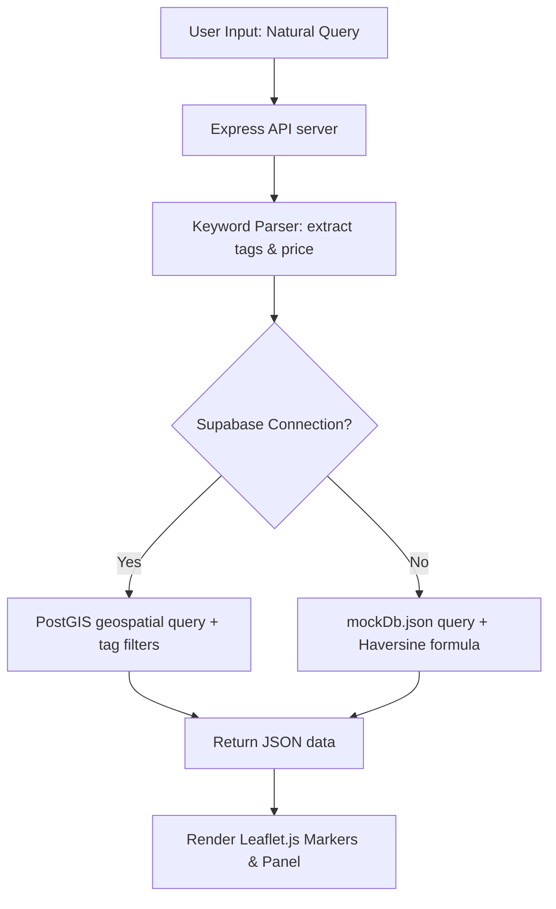

# **Mapsy: A Geospatial Map-Based Platform for Student Location Discovery with Smart Search by Situation and Community Validation**

---

### **Authors**
1. **Nicholas** (School of Computer Science, Bina Nusantara University, Jakarta, Indonesia) - *nicholas043@binus.ac.id*
2. **Daffa Adira Pratama** (School of Computer Science, Bina Nusantara University, Jakarta, Indonesia) - *daffa.pratama004@binus.ac.id*
3. **Samuel Handyanto Ongko Saputra** (School of Computer Science, Bina Nusantara University, Jakarta, Indonesia) - *samuel.saputra005@binus.ac.id*
4. **Christian Devinchie** (School of Computer Science, Bina Nusantara University, Jakarta, Indonesia) - *christian.devinchie@binus.ac.id*

---

### **Abstract**
*Higher education students, particularly freshmen and boarding students, often face difficulties finding locations conducive to both academic tasks and daily life near campus. Conventional commercial mapping applications like Google Maps tend to provide generic recommendations flooded with advertisements and lack specific filters tailored to typical student needs. This paper introduces **Mapsy**, a decentralized, hyper-local geospatial map platform designed to address student location-based constraints. The system integrates two core innovations: **Smart Search by Situation**, which leverages a dictionary-driven keyword parser to extract situational needs without costly LLM APIs, and **Community Validation**, a collaborative upvote/downvote tag mechanism that prevents data obsolescence. Mapsy was developed using a decoupled client-server architecture, utilizing a lightweight, interactive Vanilla JavaScript frontend powered by Leaflet.js, and a Node.js/Express backend connected to a PostgreSQL database (Supabase/PostGIS) with a local JSON mock database fallback. Experimental results indicate the platform successfully delivers instant recommendations based on price tiering (under Rp 30,000), power outlet availability, quietness level, Wi-Fi connectivity, and nearby printing services.*

**Keywords—** *Agile, crowdsourcing, geospatial data, location-based services, Mapsy, PostGIS, smart location search, student-friendly places, web applications.*

---

## **Chapter 1 - Introduction**

### **A. Background & Problem Statement (Core Problem)**
For urban university students demanding high efficiency, finding the right physical spot to study, work on group assignments, print academic materials, or simply find affordable meals is a daily challenge that consumes significant time. Currently available digital mapping systems (such as Google Maps or Apple Maps) are designed primarily for large-scale commercial purposes. Several key limitations of conventional maps from a student's perspective include:
1. **Lack of situational student filters**: Conventional maps do not offer search criteria for student-specific amenities such as "abundant power outlets," "quiet study atmosphere," or "nearby printing services."
2. **Commercialization of search results**: Businesses with large advertising budgets occupy top ranks, overshadowing small, high-value spots for students (*hidden gems*).
3. **Inaccurate pricing information**: Standard price indicators (like `$$`) do not reflect actual student budgets (e.g., finding lunch options under Rp 30,000).
4. **Stale amenity data**: Wi-Fi speed, power outlet status, real operating hours, and noise levels change frequently without rapid updates from the general user community.

Based on a preliminary survey conducted among 12 student respondents, 50% reported finding it hard to discover specific study spots or academic facilities around their boarding houses due to a lack of detailed information and a lack of reliable product or amenity updates.

### **B. Proposed Solution**
To address these limitations, we developed **Mapsy**, an interactive map-based Single Page Application (SPA) focusing on hyper-local visualization around university campuses (tested around BINUS University Bandung Paskal, ITB, and UNPAD Dipatiukur). The primary solutions introduced by the platform include:
* **Smart Search by Situation**: Users enter natural language queries (e.g., *"need a quiet cafe to work until late night"*). The parser engine in the backend automatically translates this into structured search filters (`Quiet`, `Good Wi-Fi`, `24 hours`) without the recurring costs of paid LLM APIs.
* **Community Validation (Anti-Obsolescence System)**: Registered students logged in with their campus email can upvote or downvote amenity tags at any location. Tags receiving a net negative confidence score are automatically hidden from the map view.
* **Weighted Rating System (Temporal Decay)**: The review system weights reviews from the last 30 days twice as high (2.0x weight) as older reviews to keep location ratings aligned with current conditions.
* **Zero-Cost Cache Strategy**: The backend caches Google Places API responses locally to minimize API query expenses.

### **C. Research Questions & Objectives**
Based on the background above, the research questions of this project are:
1. How to design a hyper-local geospatial mapping platform that provides custom recommendations aligned with specific student situations?
2. How to maintain the accuracy of facility amenity tags without relying on manual administrator moderation?

The objectives of this project are:
1. To build the Mapsy web application featuring natural language search parsing (*Smart Search by Situation*) and a multi-criteria sorting system (*Smart Ranking*).
2. To implement a collaborative upvote/downvote mechanism (*Community Validation*) to democratically validate the quality of spot tags by fellow students.

---

## **Chapter 2 - Literature Review**

The development of the Mapsy platform is grounded in several modern software engineering, spatial database, and collaborative web design principles:

### **A. Location-Based Services (LBS) & Digital Mapping**
Location-Based Services (LBS) integrate the geographic position of a mobile or web client with spatial data to deliver context-aware information [1]. Digital mapping systems present this geospatial data interactively, allowing users to zoom, pan, and query physical locations represented as coordinate markers (latitude and longitude) on a screen [2]. Mapsy utilizes web browser geolocation APIs (`navigator.geolocation`) to determine user position and falls back to a central campus location (BINUS Bandung Paskal coordinates) if GPS coordinates are unavailable.

### **B. Interactive Mapping Libraries (Leaflet.js & CARTO)**
Leaflet.js is an open-source, mobile-friendly JavaScript library designed for lightweight interactive maps [3]. Unlike heavy desktop GIS software, Leaflet renders map markers as lightweight Document Object Model (DOM) elements, allowing high-performance marker clustering, custom animations, and event binding (such as clicking a pin to open a sheet). CartoDB tile layers (specifically CartoDB Positron) provide a clean, desaturated, light-themed map style that acts as a visual baseline, preventing visual clutter when displaying complex overlay pins.

### **C. Geospatial Databases & PostGIS Indexing**
Storing and querying coordinates efficiently requires a spatial database. PostGIS is an extension for the PostgreSQL relational database that adds support for geographic objects, allowing spatial queries to be run in SQL [5]. In a standard database, searching coordinates involves range queries on both latitude and longitude (using standard B-Tree indexes), which is computationally slow ($O(N)$ scanning). PostGIS implements R-Tree indexes using Generalized Search Trees (GIST), which group spatial objects into bounding boxes, enabling $O(\log N)$ geospatial queries like "find all cafes within 500 meters of ITB" using ST_DWithin:
```sql
SELECT id, name FROM places WHERE ST_DWithin(geom, ST_MakePoint(lng, lat)::geography, 8000);
```

### **D. Agile Software Development Methodology**
Agile methods emphasize iterative development, collaboration, and responsiveness to change. It structures project lifecycles into short, fixed-length cycles called sprints, resulting in functional software increments at the end of each iteration [6]. Because Mapsy relies heavily on user-generated feedback and usability, an Agile Scrum approach allows the development team to iteratively refine interface layouts (e.g., relocating zoom buttons) and database queries based on testing.

### **E. Crowdsourcing and Collaborative Validation**
Crowdsourcing leverages a large group of users to gather data, distribute tasks, or validate information, reducing administrative overhead [7]. The primary challenge in crowdsourced directories is data obsolescence (e.g., a cafe changing its hours, or a power outlet becoming broken). Collaborative validation allows peer-users to upvote or downvote tags based on real-time observations, adjusting a tag's "confidence score." This mechanism decentralizes data moderation, ensuring that inaccurate or stale tags are filtered out automatically by community consensus.

### **F. Decoupled Architecture & Web Security**
A decoupled client-server architecture separates the user interface (frontend) from the data processor (backend). Communications occur via stateless RESTful JSON APIs. Security is maintained using JSON Web Tokens (JWT) [8]. When a student logs in, the authentication server issues a signed JWT token, which is stored in the browser's `localStorage` and sent in the `Authorization: Bearer <token>` header of every write request (such as adding a spot or review), protecting the backend from unauthorized submissions.

### **G. Geospatial Distance & the Haversine Formula**
When database extensions like PostGIS are unavailable (such as in local development fallback modes), distance calculations between the user and surrounding spots must be computed programmatically. The Haversine formula calculates the shortest distance over the Earth's surface (great-circle distance) between two points [9]:
$$d = 2R \arcsin\left(\sqrt{\sin^2\left(\frac{\Delta \phi}{2}\right) + \cos(\phi_1)\cos(\phi_2)\sin^2\left(\frac{\Delta \lambda}{2}\right)}\right)$$
Where $R$ is the Earth's radius ($6,371 \text{ km}$), $\phi$ is latitude, and $\lambda$ is longitude in radians. This formula is implemented directly in Javascript and SQL fallback queries to sort places by distance.

### **H. Dictionary-Driven Keyword Parser**
Traditional search interfaces rely on exact keyword matches or expensive semantic search AI engines (such as LLM APIs). For a free, student-centric application, a dictionary-driven keyword parser is a cost-effective alternative. It tokenizes natural language search strings (e.g., "coffee with fast wifi") and matches words against a dictionary of synonyms (e.g., "coffee", "kafe", "kopi" map to tag `Good Wi-Fi` and `Quiet`). This enables context-aware search matches in $O(M)$ time where $M$ is the query word count.

### **I. Multi-Criteria Decision Making (MCDM) & Smart Ranking Algorithms**
Selecting the optimal location from a set of geographical options requires balancing multiple, often conflicting, criteria—a classic problem in Multi-Criteria Decision Making (MCDM) [10]. In Mapsy, a Multi-Criteria Recommendation engine is implemented on the client-side to compute a normalized "Match Score" ($S_i \in [30\%, 100\%]$) for each place $i$:
$$S_i = \frac{\omega_r S_{rating} + \omega_p S_{price} + \omega_d S_{distance} + \omega_t S_{tag}}{\omega_r + \omega_p + \omega_d + \omega_t} \times 100$$
Where the weights are defined as $\omega_r = 0.30$ (Rating weight), $\omega_p = 0.20$ (Budget/Price Match weight), $\omega_d = 0.20$ (Spatial Distance weight), and $\omega_t = 0.30$ (Amenity Tag Match weight). The individual sub-scores are defined as:
1. *Rating Sub-score ($S_{rating} \in [0, 1]$)*: Formulated as $S_{rating} = R_i / 5$, where $R_i$ is the average user rating of the place.
2. *Price Sub-score ($S_{price} \in [0, 1]$)*: If a user selects a maximum price tier $P_{user} \in \{1, 2, 3, 4\}$, then $S_{price} = 1.0$ if the place's price tier $P_i \le P_{user}$, and $S_{price} = \max(0, 1.0 - (P_i - P_{user}) \times 0.35)$ otherwise. If no price tier is selected, cheap places (tier 1) are given $1.0$, tier 2 is $0.85$, tier 3 is $0.60$, and tier 4 is $0.40$.
3. *Distance Sub-score ($S_{distance} \in [0, 1]$)*: Based on spatial distance $D_i$ in meters. If $D_i \le 1000\text{ m}$, $S_{distance} = 1.0$. If $D_i \le 3000\text{ m}$, $S_{distance} = 0.85$. If $D_i \le 5000\text{ m}$, $S_{distance} = 0.65$. Otherwise, it defaults to $0.75$.
4. *Tag Sub-score ($S_{tag} \in [0, 1]$)*: If user tags $T_{selected}$ are chosen, $S_{tag} = |T_i \cap T_{selected}| / |T_{selected}|$. If no tags are selected, it is calculated based on cumulative community tag confidence: $S_{tag} = \min(1.0, 0.70 + \sum_{t \in T_i} c_t \times 0.05)$ where $c_t$ is the confidence score of tag $t$.

### **J. Temporal Decay Weighting in Reviews**
The reputation and quality of amenities at a physical venue are highly dynamic. To prevent historical ratings from overshadowing recent changes in management or infrastructure, a temporal decay weighting scheme is introduced. The overall average rating $\bar{R}$ of a location is computed using a weighted average:
$$\bar{R} = \frac{\sum_{j=1}^{N} R_j \cdot w_j}{\sum_{j=1}^{N} w_j}$$
Where $R_j$ is the rating given in review $j$, and the weight $w_j$ is dynamically computed based on the age of the review:
$$w_j = \begin{cases} 2.0, & \text{if } t_{current} - t_{review} \le 30 \text{ days} \\ 1.0, & \text{otherwise} \end{cases}$$
This ensures that recent reviews (under 30 days old) contribute twice as much to the place's visual rating as older reviews, maintaining high feedback loop responsiveness.

---

## **Chapter 3 - Methodology**

### **A. SDLC & Development Process (Agile Scrum)**
Mapsy was developed using the **Agile Scrum** framework, structured into 5 iterative sprints:
* **Sprint 1: Requirements Gathering and Problem Analysis**: Identification of core student issues, scope definition, and functional/non-functional requirements specification.
* **Sprint 2: UI/UX Design and System Design**: Wireframe designs (dark mode aesthetic), system architecture modeling, and database schema mapping.
* **Sprint 3: Map Search and Filter Implementation**: Leaflet.js map layer rendering and geospatial search queries with amenity filter integrations.
* **Sprint 4: Implementation of Crowdsourced Review and Validation**: Registration/login flow, User Generated Content (UGC) spot creation, temporal decay reviews, and upvote/downvote logic.
* **Sprint 5: Testing, Evaluation, and Improvement**: Functional testing and usability testing with student users to refine UI/UX interactions.



### **B. Database Schema Design (ERD)**
The database schema is structured relationally to support tag validation and student reviews:
1. **places**: Stores place names, descriptions, coordinates (latitude, longitude), average pricing (`avg_price_tier`), cover photos (`image_url`), and Google Place IDs.
2. **tags**: Stores situational tag types (`Quiet`, `Good Wi-Fi`, `Many charging ports`, `24 hours`, `Printer nearby`).
3. **place_tags**: A junction table mapping places to tags containing the validation `confidence_score`.
4. **reviews**: Stores rating values, comments, timestamps (`created_at`), and user foreign keys.

### **C. System Workflow**
The workflow begins when a user accesses the Mapsy landing page. The map initializes and centers on the primary campus (BINUS Bandung).
1. The user inputs a situational search query or selects filter badges.
2. The backend parser extracts matching tags and budget levels.
3. The server runs coordinate-based filtering (using Haversine or PostGIS) to find spots within an 8 km radius matching the criteria.
4. Spots are ranked using the *Smart Ranking* algorithm (combining rating, distance, price match, and tag confidence) and sent to the frontend.
5. The frontend updates Leaflet.js map markers and renders the left sidebar recommendation list.

---

## **Chapter 4 - Experimental Results**

### **A. Test Environment, Tools, and Frameworks**
* **Frontend**: HTML5, Vanilla JavaScript, Tailwind CSS v4, Leaflet.js, Lucide Icons.
* **Backend**: Node.js v18+, Express, Cors, Dotenv.
* **Storage**: PostgreSQL (Supabase/PostGIS) or local JSON-based fallback (`mockDb.json`) for offline testing.
* **Deployment target**: Serverless deployment on Vercel (`vercel.json`) with frontend asset bundling.

### **B. Feature Implementation & User Interface**
The Mapsy web application was successfully deployed with a premium dark-themed responsive interface. Key features validated include:
1. **Interactive Geospatial Map**: Renders campus coordinates and surrounding student spots. Leaflet zoom controls are positioned in the **top-right** (`topright`) to prevent overlap with the bottom action button.
2. **Smart Search & Recommendations Panel**: Users search using natural phrases. Results are rendered in the left panel sorted by **Match Score (Skor Kecocokan %)**, with sorting options for **Closest Distance** or **Highest Rating**.
3. **Cover Photo Integration**: The detail panel displays location cover photos. A dynamic fallback system maps relevant Unsplash images based on search category if no custom photo exists.
4. **UGC Spot Contributions**: Authenticated users add spots by clicking on the map, selecting a main category, budget tier (Cheap, Medium, Moderate, Premium), and specifying an optional photo URL.
5. **Community Moderation**: Upvotes and downvotes update tag confidence scores in real-time. Downvoted tags with negative values are hidden from filter criteria.

---

## **Chapter 5 - Conclusion**

The Mapsy project successfully addresses the demand for a student-centric mapping platform that handles situational needs and budget constraints. By employing a lightweight dictionary parser, the platform minimizes operational costs by avoiding paid LLM integrations. The crowdsourced validation mechanism (upvote/downvote tags) effectively keeps data accurate without manual administrative oversight. Furthermore, the *Smart Ranking* recommendation list (combining distance, rating, budget, and tag confidence) helps students make decisions quickly. Future work will focus on integrating semantic search using *Supabase pgvector embeddings* and developing a hybrid mobile application.

---

### **Acknowledgement**
The authors express their gratitude to the Software Engineering course instructor, colleagues at Bina Nusantara University for feedback during interface testing, and the developers of Leaflet.js and Tailwind CSS.

---

### **Contribution**
* **Nicholas**: Requirements gathering, database schema design, and drafting the initial report structure.
* **Daffa Adira Pratama**: API development, keyword parser logic, Vercel serverless integration, and directory path optimizations.
* **Samuel Handyanto Ongko Saputra**: UI/UX design using Tailwind CSS v4, Leaflet map configuration, zoom control positioning, and Top Recommendations list panel integration.
* **Christian Devinchie**: Seeding the mock database with 20+ Bandung locations, preparing review test data, testing functional scenarios, and formatting the IEEE bibliography.

---

### **Open Data Access**
The frontend code, backend server, database schemas, and seed location data are publicly available at the project's GitHub repository: `https://github.com/McDaveStar/Mapsy`

---

## **References (IEEE Format)**

[1] J. Schiller and A. Voisard, *Location-Based Services*, Boston, MA: Morgan Kaufmann, 2004, p. 255. [Online]. Available: https://books.google.com/books/about/Location_Based_Services.html?hl=id&id=wj19b5wVfXAC  
[2] M. J. Smith, "Digital Mapping: Visualisation, Interpretation and Quantification of Landforms," *Developments in Earth Surface Processes*, vol. 15, pp. 225–251, 2011, doi: 10.1016/B978-0-444-53446-0.00008-2.  
[3] OpenStreetMap Contributors, "Leaflet - a JavaScript library for interactive maps," 2026. [Online]. Available: https://leafletjs.com/index.html  
[4] CARTO Spatial Platform, "Welcome | CARTO Documentation," 2026. [Online]. Available: https://docs.carto.com/  
[5] Supabase Inc., "PostGIS: Geo queries | Supabase Docs," 2026. [Online]. Available: https://supabase.com/docs/guides/database/extensions/postgis  
[6] K. Schwaber and M. Beedle, *Agile Software Development with Scrum*, Upper Saddle River, NJ: Prentice Hall, 2002.  
[7] D. Brabham, *Crowdsourcing*, Cambridge, MA: MIT Press, 2013.  
[8] M. B. Jones, J. Bradley, and N. Sakimura, "JSON Web Token (JWT)," IETF RFC 7519, May 2015. [Online]. Available: https://tools.ietf.org/html/rfc7519  
[9] R. W. Sinnott, "Virtues of the Haversine," *Sky and Telescope*, vol. 68, no. 2, p. 159, 1984.  
[10] E. Triantaphyllou, *Multi-criteria Decision Making Methods: A Comparative Study*, Dordrecht, Netherlands: Kluwer Academic Publishers, 2000.  
