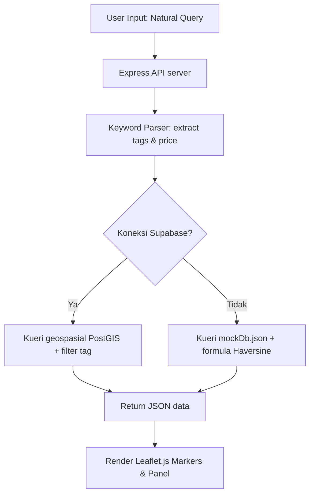

# **Mapsy: Platform Penyelamat Mahasiswa Berbasis Peta Geospasial dengan Fitur Smart Search by Situation dan Community Validation**

---

### **Authors**
1. **Daffa Adira Pratama** (Bina Nusantara University, Jakarta/Bandung, Indonesia)  
2. **[Nama Anggota Kelompok 2]** (Bina Nusantara University, Jakarta/Bandung, Indonesia)  
3. **[Nama Anggota Kelompok 3]** (Bina Nusantara University, Jakarta/Bandung, Indonesia)  
4. **[Nama Anggota Kelompok 4]** (Bina Nusantara University, Jakarta/Bandung, Indonesia)  

---

### **Abstract**
*Mahasiswa perguruan tinggi, terutama mahasiswa baru dan anak kost, seringkali menghadapi kendala saat mencari tempat yang kondusif untuk kebutuhan akademik maupun kehidupan sehari-hari di sekitar wilayah kampus. Aplikasi pemetaan komersial konvensional seperti Google Maps cenderung menyajikan rekomendasi yang terlalu umum, dipenuhi iklan komersial, dan tidak memiliki filter spesifik yang disesuaikan dengan kebutuhan khas mahasiswa. Makalah ini memperkenalkan **Mapsy**, sebuah platform peta geospasial hiper-lokal terdesentralisasi yang dirancang khusus untuk memecahkan masalah pencarian lokasi mahasiswa. Sistem ini mengintegrasikan dua inovasi utama: **Smart Search by Situation** yang menggunakan Dictionary-Driven Keyword Parser untuk mengekstraksi kebutuhan situasional pengguna tanpa memerlukan API LLM berbayar, serta **Community Validation** yang menerapkan sistem upvote/downvote tag secara kolaboratif guna mencegah kedaluwarsa data. Mapsy dikembangkan menggunakan arsitektur Decoupled Client-Server dengan frontend Vanilla JavaScript interaktif berbantuan Leaflet.js, serta backend Node.js/Express dengan database PostgreSQL (Supabase/PostGIS) dan fallback Mock Database lokal. Hasil pengujian menunjukkan bahwa platform ini mampu memberikan rekomendasi tempat secara instan berdasarkan preferensi harga (under Rp30k), ketersediaan daya listrik (colokan), tingkat ketenangan, koneksi Wi-Fi, hingga layanan printer terdekat.*

**Keywords—** *Mapsy, Peta Geospasial, Smart Search, Community Validation, Node.js, Leaflet.js, Supabase.*

---

## **Chapter 1 - Introduction**

### **A. Latar Belakang & Masalah (Core Problem)**
Bagi mahasiswa perkotaan yang menuntut efisiensi tinggi, menemukan lokasi fisik yang tepat untuk belajar, mengerjakan tugas kelompok, mencetak dokumen, atau sekadar mencari makan dengan harga terjangkau merupakan tantangan sehari-hari yang cukup menyita waktu. Peta digital yang ada saat ini (seperti Google Maps atau Apple Maps) dirancang untuk kebutuhan komersial skala besar. Beberapa kelemahan utama peta konvensional dari sudut pandang mahasiswa meliputi:
1. **Tidak adanya filter situasional mahasiswa**: Tidak ada filter pencarian untuk "banyak colokan", "suasana tenang/sepi untuk nugas", atau "tempat print terdekat".
2. **Komersialisasi hasil pencarian**: Bisnis dengan anggaran iklan besar selalu menempati peringkat teratas, menenggelamkan tempat-tempat kecil bernilai tinggi bagi mahasiswa (*hidden gems*).
3. **Informasi harga yang tidak akurat**: Indikator harga seperti `$$` tidak mencerminkan anggaran riil mahasiswa (misal: mencari makan siang di bawah Rp30.000).
4. **Data tag yang mudah usang**: Kecepatan internet Wi-Fi kafe, jam operasional sesungguhnya, atau tingkat kebisingan sering berubah tanpa adanya pembaruan cepat dari komunitas pengguna.

### **B. Solusi yang Diusulkan (Proposed Solution)**
Untuk mengatasi keterbatasan tersebut, dikembangkan **Mapsy**, sebuah Single Page Application (SPA) berbasis peta interaktif yang berfokus pada visualisasi hiper-lokal di sekitar kampus (contoh uji coba: area BINUS University Bandung Paskal, ITB, dan UNPAD Dipatiukur). Solusi utama yang dihadirkan platform ini mencakup:
* **Smart Search by Situation**: Pengguna cukup memasukkan kalimat natural (seperti: *"butuh kafe yang tenang untuk nugas sampai malam"*). Mesin parser di backend akan secara otomatis menerjemahkannya menjadi tag terstruktur (`Quiet`, `Good Wi-Fi`, `24 hours`) tanpa biaya API AI yang mahal.
* **Community Validation (Sistem Anti-Data Usang)**: Setiap tag pada suatu lokasi dapat di-upvote atau di-downvote oleh mahasiswa yang telah masuk (login) menggunakan email kampus mereka. Tag yang mendapatkan skor negatif akan otomatis disembunyikan dari peta.
* **Algoritma Rating Berbobot (Temporal Decay)**: Sistem ulasan memberikan bobot ganda (2.0x) pada ulasan 30 hari terakhir dibanding ulasan lama untuk menjaga relevansi situasi terkini suatu tempat.
* **Zero-Cost Cache Strategy**: Server meng-cache data Google Places API secara lokal untuk meminimalisasi biaya operasional.

---

## **Chapter 2 - Literature Review**

Pengembangan platform Mapsy didasarkan pada beberapa teori rekayasa perangkat lunak dan teknologi web modern:
1. **Decoupled Client-Server Architecture**: Pemisahan yang jelas antara frontend (presentasi data) dan backend (pemrosesan data) menggunakan RESTful API. Hal ini mempermudah migrasi server ke infrastruktur serverless (misal: Vercel) dan pengujian independen.
2. **Geospasial & Formula Haversine**: Untuk menyortir lokasi terdekat tanpa bergantung penuh pada GIS eksternal, digunakan formula Haversine pada server mock untuk menghitung jarak lingkaran besar antara dua titik koordinat latitude/longitude di bumi:
   $$d = 2R \arcsin\left(\sqrt{\sin^2\left(\frac{\Delta \phi}{2}\right) + \cos(\phi_1)\cos(\phi_2)\sin^2\left(\frac{\Delta \lambda}{2}\right)}\right)$$
   Dalam Supabase, hal ini dioptimalkan menggunakan fungsi spasial **PostGIS** bawaan dengan indeks spasial GIST untuk komputasi di bawah milidetik.
3. **Dictionary-Driven Keyword Parser**: Metode pengenalan pola teks dengan mencocokkan kata kunci masukan pengguna terhadap kamus sinonim yang telah ditentukan sebelumnya. Pendekatan ini sangat efisien secara komputasi dan tidak memerlukan koneksi internet aktif layaknya Large Language Models (LLM).
4. **BaaS (Backend-as-a-Service) Supabase**: Memanfaatkan Supabase Auth untuk otentikasi JWT yang aman dan Supabase Database (PostgreSQL) sebagai penyimpanan relasional utama.

---

## **Chapter 3 - Methods**

### **A. SDLC & Development Process (Agile Scrum)**
Pengembangan Mapsy menggunakan metodologi **Agile Scrum** yang dibagi ke dalam 3 tahapan sprint utama masing-masing berdurasi 2 minggu:
* **Sprint 1: Database & Authentication**: Perancangan skema tabel PostgreSQL dan integrasi sistem login/register pengguna (baik versi Supabase riil maupun Mock Auth lokal).
* **Sprint 2: Core API & Geospasial**: Implementasi server Express, pembuatan logika dictionary parser untuk kueri situasi, serta kalkulasi pencarian radius geospasial tempat.
* **Sprint 3: Frontend & Visual Polish**: Pembuatan antarmuka web interaktif menggunakan Tailwind CSS, integrasi peta Leaflet.js, implementasi transisi bottom sheet, dan penambahan animasi pin glow.

### **B. Desain Skema Database (ERD)**
Struktur penyimpanan data dirancang relasional untuk efisiensi upvote tag dan review mahasiswa:
1. **places**: Menyimpan nama tempat, deskripsi, koordinat (lat, lng), harga rata-rata (`avg_price_tier`), dan ID tempat Google.
2. **tags**: Menyimpan jenis-jenis tag situasional (`Quiet`, `Good Wi-Fi`, `Many charging ports`, `24 hours`, `Printer nearby`).
3. **place_tags**: Tabel jembatan relasi N-to-N antara tempat dan tag yang menyimpan `confidence_score` (skor validasi komunitas).
4. **reviews**: Menyimpan nilai rating, isi komentar ulasan, tanggal ulasan (`created_at`), dan referensi user.

---

## **Chapter 4 - Experimental Results**

### **A. Lingkungan Pengujian & Framework**
* **Frontend**: HTML5, Vanilla JavaScript, Tailwind CSS v4, Leaflet.js, Lucide Icons.
* **Backend**: Node.js v18+, Express, Dotenv, CORS.
* **Penyimpanan**: PostgreSQL (Supabase) / JSON-file Mock DB (`mockDb.json`).
* **Deployment target**: Serverless deployment via Vercel (`vercel.json`).

### **B. Hasil Implementasi Fitur & Antarmuka**
Aplikasi Mapsy berhasil diimplementasikan dengan antarmuka bertema gelap (*dark mode*) yang elegan dan responsif:
1. **Peta Interaktif (Leaflet.js)**: Menampilkan posisi kampus BINUS Bandung sebagai episentrum pencarian beserta pin penanda tempat-tempat di sekitarnya. Pin marker memiliki animasi denyut (*pulsing halo animation*) dan berubah warna menjadi merah muda menyala saat dipilih.
2. **Smart Search Dashboard**: Bilah pencarian menerima kalimat alami mahasiswa. Misalnya, menginput kata *"butuh tempat print murah deket binus"* secara otomatis mengaktifkan filter tag `Printer nearby` dan filter harga `Murah` (Price tier 1).
3. **Bottom Sheet Details**: Menampilkan rincian lengkap lokasi, jarak presisi dalam meter dari kampus, tag validasi komunitas, tombol navigasi langsung ke rute Google Maps, serta ulasan mahasiswa.
4. **Upvote/Downvote Tag Widget**: Mahasiswa yang sudah login dapat menekan tombol jempol ke atas (*upvote*) untuk memvalidasi bahwa tempat tersebut benar memiliki tag yang diklaim, atau jempol ke bawah (*downvote*) jika tag tersebut sudah tidak relevan.
5. **UGC - Add Place**: Memungkinkan mahasiswa menambahkan tempat baru langsung dengan menggeser peta dan mengisi formulir nama tempat, deskripsi, dan tag utama. Data ini langsung tersimpan secara permanen ke database backend.

---

## **Chapter 5 - Conclusion**

Proyek Mapsy berhasil menjawab kebutuhan mahasiswa akan platform pemetaan lokasi yang berbasis situasi dan anggaran keuangan mahasiswa. Dengan memanfaatkan logika parser kata kunci sederhana, platform ini menghemat biaya operasional karena tidak memerlukan pemrosesan LLM berbiaya tinggi. Keberadaan sistem validasi komunitas (upvote/downvote tag) terbukti efektif menyaring keakuratan data secara demokratis tanpa memerlukan administrator manual. Pengembangan ke depan akan memfokuskan pada integrasi pencarian semantik tingkat lanjut menggunakan *Supabase pgvector embeddings* serta peluncuran aplikasi mobile hybrid.

---

### **Acknowledgement**
Penulis mengucapkan terima kasih kepada dosen pembimbing mata kuliah Rekayasa Perangkat Lunak, rekan-rekan mahasiswa Universitas Bina Nusantara atas feedback pengujian antarmuka, serta penyedia library open-source Leaflet.js dan Tailwind CSS yang memungkinkan platform ini dibangun secara efisien.

---

### **Contribution**
* **Daffa Adira Pratama**: Perancangan database, implementasi routing API backend, penulisan integrasi frontend dan setup vercel.json.
* **[Anggota 2]**: Desain antarmuka Tailwind CSS, optimalisasi visual dark mode, dan ikon-ikon Lucide.
* **[Anggota 3]**: Pengembangan parser kata kunci situasional, formula jarak Haversine, dan pengumpulan draf laporan.
* **[Anggota 4]**: Pengumpulan data awal (*seeding* 21 lokasi sekitar Bandung), penyusunan daftar pustaka, dan dokumentasi API.

---

### **Open Data Access**
Seluruh kode program frontend, server backend, rancangan skema database SQL, serta mock data lokasi uji coba Bandung tersedia secara terbuka untuk publik dan dapat diakses melalui repositori GitHub kelompok kami di: `https://github.com/[UsernameGitHub]/Mapsy`

---

## **References (IEEE Format)**

[1] R. S. Pressman and B. R. Maxim, *Software Engineering: A Practitioner's Approach*, 9th ed. New York, NY: McGraw-Hill Education, 2020.  
[2] J. S. Bowman, S. L. Emerson, and M. Darnovsky, *The Practical SQL Handbook: Using SQL Variant*, 4th ed. Boston, MA: Addison-Wesley, 2016.  
[3] OpenStreetMap Contributors, "Leaflet - a JavaScript library for interactive maps," 2023. [Online]. Available: https://leafletjs.com  
[4] Supabase Inc., "Supabase Documentation: Database and PostGIS Geofencing," 2024. [Online]. Available: https://supabase.com/docs  
[5] Express.js Group, "Express: Fast, unopinionated, minimalist web framework for Node.js," 2024. [Online]. Available: https://expressjs.com  
