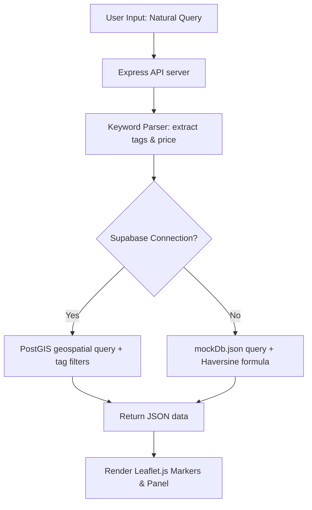

# **Mapsy: A Geospatial Map-Based Platform for Student Location Discovery with Smart Search by Situation and Community Validation**

---

### **Authors**
1. **Nicholas** (School of Computer Science, Bina Nusantara University, Jakarta, Indonesia) - *nicholas043@binus.ac.id*
2. **Daffa Adira Pratama** (School of Computer Science, Bina Nusantara University, Jakarta, Indonesia) - *daffa.pratama004@binus.ac.id*
3. **Samuel Handyanto Ongko Saputra** (School of Computer Science, Bina Nusantara University, Jakarta, Indonesia) - *samuel.saputra005@binus.ac.id*
4. **Christian Devinchie** (School of Computer Science, Bina Nusantara University, Jakarta, Indonesia) - *christian.devinchie@binus.ac.id*

---

### **Abstract**
*Higher education students, particularly freshmen and boarding students, often face difficulties finding locations conducive to both academic tasks and daily life near campus. Conventional commercial mapping applications like Google Maps tend to provide generic recommendations flooded with advertisements and lack specific filters tailored to typical student needs. This paper introduces **Mapsy**, a decentralized, hyper-local geospatial map platform designed to address student location-based constraints. The system integrates two core innovations: **Smart Search by Situation**, which leverages a dictionary-driven keyword parser to extract situational needs without costly LLM APIs, and **Community Validation**, a collaborative upvote/downvote tag mechanism that prevents data obsolescence. Mapsy was developed using a decoupled client-server architecture, utilizing a lightweight, interactive Vanilla JavaScript frontend powered by Leaflet.js, and a Node.js/Express backend connected to a PostgreSQL database (Supabase/PostGIS) with a local JSON mock database fallback. Experimental results indicate the platform successfully delivers instant recommendations based on price tiering (under Rp 30,000), power outlet availability, quietness level, Wi-Fi connectivity, and nearby printing services.*

**Keywords—** *Agile, crowdsourcing, geospatial data, location-based services, Mapsy, PostGIS, smart location search, student-friendly places, web applications.*

---

## **Chapter 1 - Introduction**

### **A. Background & Problem Statement (Core Problem)**
For urban university students demanding high efficiency, finding the right physical spot to study, work on group assignments, print academic materials, or simply find affordable meals is a daily challenge that consumes significant time. Currently available digital mapping systems (such as Google Maps or Apple Maps) are designed primarily for large-scale commercial purposes. Several key limitations of conventional maps from a student's perspective include:
1. **Lack of situational student filters**: Conventional maps do not offer search criteria for student-specific amenities such as "abundant power outlets," "quiet study atmosphere," or "nearby printing services."
2. **Commercialization of search results**: Businesses with large advertising budgets occupy top ranks, overshadowing small, high-value spots for students (*hidden gems*).
3. **Inaccurate pricing information**: Standard price indicators (like `$$`) do not reflect actual student budgets (e.g., finding lunch options under Rp 30,000).
4. **Stale amenity data**: Wi-Fi speed, power outlet status, real operating hours, and noise levels change frequently without rapid updates from the general user community.

Based on a preliminary survey conducted among 12 student respondents, 50% reported finding it hard to discover specific study spots or academic facilities around their boarding houses due to a lack of detailed information and a lack of reliable product or amenity updates.

### **B. Proposed Solution**
To address these limitations, we developed **Mapsy**, an interactive map-based Single Page Application (SPA) focusing on hyper-local visualization around university campuses (tested around BINUS University Bandung Paskal, ITB, and UNPAD Dipatiukur). The primary solutions introduced by the platform include:
* **Smart Search by Situation**: Users enter natural language queries (e.g., *"need a quiet cafe to work until late night"*). The parser engine in the backend automatically translates this into structured search filters (`Quiet`, `Good Wi-Fi`, `24 hours`) without the recurring costs of paid LLM APIs.
* **Community Validation (Anti-Obsolescence System)**: Registered students logged in with their campus email can upvote or downvote amenity tags at any location. Tags receiving a net negative confidence score are automatically hidden from the map view.
* **Weighted Rating System (Temporal Decay)**: The review system weights reviews from the last 30 days twice as high (2.0x weight) as older reviews to keep location ratings aligned with current conditions.
* **Zero-Cost Cache Strategy**: The backend caches Google Places API responses locally to minimize API query expenses.

### **C. Research Questions & Objectives**
Based on the background above, the research questions of this project are:
1. How to design a hyper-local geospatial mapping platform that provides custom recommendations aligned with specific student situations?
2. How to maintain the accuracy of facility amenity tags without relying on manual administrator moderation?

The objectives of this project are:
1. To build the Mapsy web application featuring natural language search parsing (*Smart Search by Situation*) and a multi-criteria sorting system (*Smart Ranking*).
2. To implement a collaborative upvote/downvote mechanism (*Community Validation*) to democratically validate the quality of spot tags by fellow students.

---

## **Chapter 2 - Literature Review**

The development of the Mapsy platform is grounded in several modern software engineering and web technology principles:
1. **Location-Based Services (LBS)**: Services that integrate a user's geographic location with general information utilities, such as maps and route planners [1].
2. **Digital Mapping Systems**: Interfaces allowing users to interact with geographic information visualized on digital displays [2].
3. **Leaflet.js**: A lightweight, open-source JavaScript library for mobile-friendly interactive maps [3]. It is used on the Mapsy frontend to render markers, popups, and geospasial coordinates.
4. **CARTO**: A cloud-native spatial platform for GIS analysis and cloud data warehouse integration [4].
5. **PostGIS & Supabase**: A PostgreSQL database extension that enables geospatial query processing and indexing (GIST indexes) for high-performance coordinate calculations [5].
6. **Decoupled Client-Server Architecture**: A pattern that separates frontend presentation from backend logic via RESTful APIs, facilitating serverless deployments (such as Vercel) and automated testing.
7. **Haversine Formula**: Used in the local mock database path to calculate the great-circle distance between two coordinate points on Earth:
   $$d = 2R \arcsin\left(\sqrt{\sin^2\left(\frac{\Delta \phi}{2}\right) + \cos(\phi_1)\cos(\phi_2)\sin^2\left(\frac{\Delta \lambda}{2}\right)}\right)$$
8. **Dictionary-Driven Keyword Parser**: A computational method for matching natural text input against a pre-defined dictionary of synonyms. This approach is highly efficient, runs locally, and incurs no API request costs.

---

## **Chapter 3 - Methodology**

### **A. SDLC & Development Process (Agile Scrum)**
Mapsy was developed using the **Agile Scrum** framework, structured into 5 iterative sprints:
* **Sprint 1: Requirements Gathering and Problem Analysis**: Identification of core student issues, scope definition, and functional/non-functional requirements specification.
* **Sprint 2: UI/UX Design and System Design**: Wireframe designs (dark mode aesthetic), system architecture modeling, and database schema mapping.
* **Sprint 3: Map Search and Filter Implementation**: Leaflet.js map layer rendering and geospatial search queries with amenity filter integrations.
* **Sprint 4: Implementation of Crowdsourced Review and Validation**: Registration/login flow, User Generated Content (UGC) spot creation, temporal decay reviews, and upvote/downvote logic.
* **Sprint 5: Testing, Evaluation, and Improvement**: Functional testing and usability testing with student users to refine UI/UX interactions.

### **B. Database Schema Design (ERD)**
The database schema is structured relationally to support tag validation and student reviews:
1. **places**: Stores place names, descriptions, coordinates (latitude, longitude), average pricing (`avg_price_tier`), cover photos (`image_url`), and Google Place IDs.
2. **tags**: Stores situational tag types (`Quiet`, `Good Wi-Fi`, `Many charging ports`, `24 hours`, `Printer nearby`).
3. **place_tags**: A junction table mapping places to tags containing the validation `confidence_score`.
4. **reviews**: Stores rating values, comments, timestamps (`created_at`), and user foreign keys.

### **C. System Workflow**
The workflow begins when a user accesses the Mapsy landing page. The map initializes and centers on the primary campus (BINUS Bandung).
1. The user inputs a situational search query or selects filter badges.
2. The backend parser extracts matching tags and budget levels.
3. The server runs coordinate-based filtering (using Haversine or PostGIS) to find spots within an 8 km radius matching the criteria.
4. Spots are ranked using the *Smart Ranking* algorithm (combining rating, distance, price match, and tag confidence) and sent to the frontend.
5. The frontend updates Leaflet.js map markers and renders the left sidebar recommendation list.

---

## **Chapter 4 - Experimental Results**

### **A. Test Environment, Tools, and Frameworks**
* **Frontend**: HTML5, Vanilla JavaScript, Tailwind CSS v4, Leaflet.js, Lucide Icons.
* **Backend**: Node.js v18+, Express, Cors, Dotenv.
* **Storage**: PostgreSQL (Supabase/PostGIS) or local JSON-based fallback (`mockDb.json`) for offline testing.
* **Deployment target**: Serverless deployment on Vercel (`vercel.json`) with frontend asset bundling.

### **B. Feature Implementation & User Interface**
The Mapsy web application was successfully deployed with a premium dark-themed responsive interface. Key features validated include:
1. **Interactive Geospatial Map**: Renders campus coordinates and surrounding student spots. Leaflet zoom controls are positioned in the **top-right** (`topright`) to prevent overlap with the bottom action button.
2. **Smart Search & Recommendations Panel**: Users search using natural phrases. Results are rendered in the left panel sorted by **Match Score (Skor Kecocokan %)**, with sorting options for **Closest Distance** or **Highest Rating**.
3. **Cover Photo Integration**: The detail panel displays location cover photos. A dynamic fallback system maps relevant Unsplash images based on search category if no custom photo exists.
4. **UGC Spot Contributions**: Authenticated users add spots by clicking on the map, selecting a main category, budget tier (Cheap, Medium, Moderate, Premium), and specifying an optional photo URL.
5. **Community Moderation**: Upvotes and downvotes update tag confidence scores in real-time. Downvoted tags with negative values are hidden from filter criteria.

---

## **Chapter 5 - Conclusion**

The Mapsy project successfully addresses the demand for a student-centric mapping platform that handles situational needs and budget constraints. By employing a lightweight dictionary parser, the platform minimizes operational costs by avoiding paid LLM integrations. The crowdsourced validation mechanism (upvote/downvote tags) effectively keeps data accurate without manual administrative oversight. Furthermore, the *Smart Ranking* recommendation list (combining distance, rating, budget, and tag confidence) helps students make decisions quickly. Future work will focus on integrating semantic search using *Supabase pgvector embeddings* and developing a hybrid mobile application.

---

### **Acknowledgement**
The authors express their gratitude to the Software Engineering course instructor, colleagues at Bina Nusantara University for feedback during interface testing, and the developers of Leaflet.js and Tailwind CSS.

---

### **Contribution**
* **Nicholas**: Requirements gathering, database schema design, and drafting the initial report structure.
* **Daffa Adira Pratama**: API development, keyword parser logic, Vercel serverless integration, and directory path optimizations.
* **Samuel Handyanto Ongko Saputra**: UI/UX design using Tailwind CSS v4, Leaflet map configuration, zoom control positioning, and Top Recommendations list panel integration.
* **Christian Devinchie**: Seeding the mock database with 20+ Bandung locations, preparing review test data, testing functional scenarios, and formatting the IEEE bibliography.

---

### **Open Data Access**
The frontend code, backend server, database schemas, and seed location data are publicly available at the project's GitHub repository: `https://github.com/McDaveStar/Mapsy`

---

## **References (IEEE Format)**

[1] J. Schiller and A. Voisard, *Location-Based Services*, Boston, MA: Morgan Kaufmann, 2004, p. 255. [Online]. Available: https://books.google.com/books/about/Location_Based_Services.html?hl=id&id=wj19b5wVfXAC  
[2] M. J. Smith, "Digital Mapping: Visualisation, Interpretation and Quantification of Landforms," *Developments in Earth Surface Processes*, vol. 15, pp. 225–251, 2011, doi: 10.1016/B978-0-444-53446-0.00008-2.  
[3] OpenStreetMap Contributors, "Leaflet - a JavaScript library for interactive maps," 2026. [Online]. Available: https://leafletjs.com/index.html  
[4] CARTO Spatial Platform, "Welcome | CARTO Documentation," 2026. [Online]. Available: https://docs.carto.com/  
[5] Supabase Inc., "PostGIS: Geo queries | Supabase Docs," 2026. [Online]. Available: https://supabase.com/docs/guides/database/extensions/postgis  
